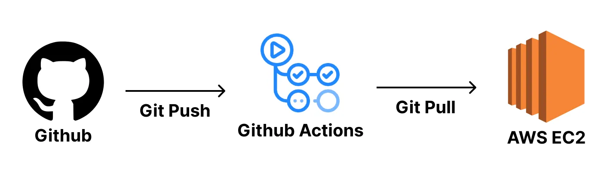

개인 프로젝트용 CI_CD
==

장점 : 코드 바뀐 부분만 업데이트하므로 속도 빠름, 인프라 구조 단순

단점 : EC2 내에서 코드가 다 실행되므로 서버 성능 영향, 계정 정보 저장 이슈

Git Repository 만들기
--
스프링 부트 프로젝트 만들어서 Git Repository에 올리기

EC2 생성
--
성능 조금 더 좋은 거 쓰고, 보안그룹 8080포트 열어서 EC2 생성해주자

EC2 환경 구성
--
배포를 위한 기본적인 환경 구성해주기
- tistory 블로그 참조

그 후
> nohup java -jar 프로젝트명-SNAPSHOT.jar & 

실행으로 8080포트에 스프링 부트 서버 띄워주기
> sudo lsof -i:8080

8080포트 확인하기

CI/CD를 하는 이유는 git push를 할 때마다 EC2에서 git pull을 하여 재배포하는 것이 매우 귀찮다

git pull 후

> sudo lsof -i:8080 # 8080번 포트에 Spring Boot가 실행되고 있는 지 확인

> sudo fuser -k -n tcp 8080 # 8080번 포트에 실행되고 있는 프로세스 종료

> ./gradlew clean build

> cd build/libs

> nohup java -jar ________.jar &

이런식으로 계속 재배포해야하는 번거로움이 있다. 따라서 CI/CD를 활용하자!!!

Git pull 할때마다 계정과 비밀번호 치는 과정 없애기
--
> git config --global credential.helper store

해당 명령어를 작성하면 git pull 하였을 때 계정과 비밀번호를 저장하여 ~/.git-credentials 에 로그인 정보를 저장해둔다.
- 따라서 이 방식이 개인 프로젝트에만 활용되어야 한다. 정보 유출...

코드 배포 자동화
--
이 방식은 Github Actions에서 EC에 접속하여 EC2 내에서 scripts의 명령어들을 돌리는 방식이다.

다 가져다 쓰기는 그렇고 강의의 파일을 참조하자

여기서 github의 secrets에 값들을 추가해야하는데
- HOST : IP 주소
- username : ubuntu
- key : 키 페어 값(이거 복붙 할때 마지막 한 글자 조심하기)

그리고 script에 아까 재배포하는 코드를 작성해주자.

application.yml 파일 넣기 자동화
--
추가적으로 해줘야할 작업이 있다.

민감 폴더를 EC2내에 넣어줘야하는데 env: 를 활용하여 넣어줄 수 있다. 그리고 script도 일부 수정해주자.

github의 secrets에 값을 추가 하자
- APPLICATION_PROPERTIES 에 파일 내용 복붙
