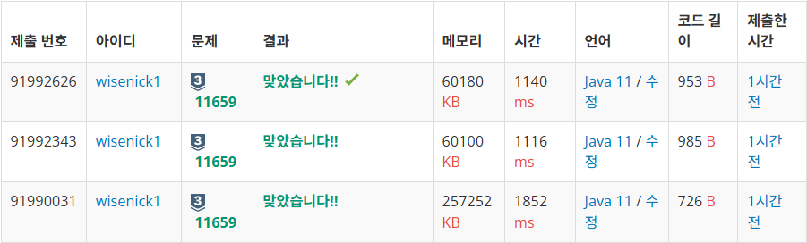

구간 합(+BufferedReader)
==
> 출처 : [Do it! 알고리즘 코딩테스트 with JAVA](https://www.inflearn.com/course/%EB%91%90%EC%9E%87-%EC%95%8C%EA%B3%A0%EB%A6%AC%EC%A6%98-%EC%BD%94%EB%94%A9%ED%85%8C%EC%8A%A4%ED%8A%B8-%EC%9E%90%EB%B0%94/dashboard)

배열에서 i~j인덱스까지의 합을 구해 새로운 배열을 만드는 것

-> 배열의 구간마다 매번 새로 합을 구한다면 시간 초과 등이 발생 할 수 있다.

:rocket: A배열의 합으로 만든 배열 S에서 S[j] - S[i-1]은 A배열의 i~j까지의 합이다.

백준 11659번
--
처음에는 Scanner를 활용하여 값을 받았고, sum 값을 활용해 합 배열을 만들었다.

BufferedReader를 사용하니 확실히 메모리와 시간이 줄어든 것을 볼 수 있다.

BufferedReader 사용법

BufferedReader br = new BufferedReader(new InputStreamReader(System.in));

StringTokenizer st = new StringTokenizer(br.readLine());

이렇게 하면 한 줄을 읽어들이게 되고 st.nextToken()으로 공백 구별되는 하나의 값을 받을 수 있다.

> StringTokenizer st = new StringTokenizer(br.readLine(), ","); -이런식으로 하면 (,)로 구분되게 받을 수 있다

다만 이름 처럼 st.nextToken()은 String이니 알아서 잘 바꿔서~~