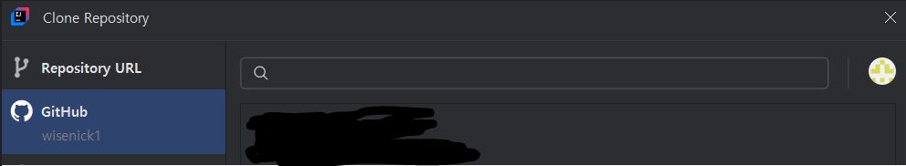
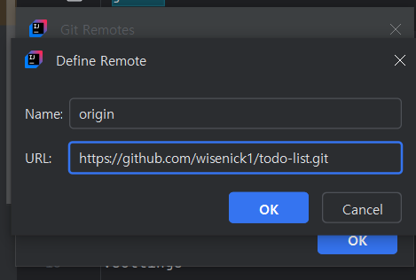
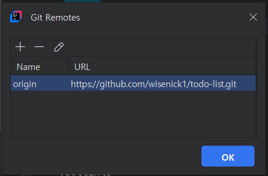

아래처럼 github와 연결은 되어 있는 상황

로컬 Git Repository 생성
--
- VCS → Create Git Repository -> 해당 프로젝트 파일 선택

Intellij에서 GitHub Repository 등록
--
- Git → Manage Remotes

연결 하는 git repository의 주소 가져오기

연동 확인

gitignore 설정
--
- gitignore 설정 시 gitignore.io 페이지에서 간편하게 설정가능, 만들어서 gitignore에 복붙

git pull 해주고 commit 하고 push 하면 끝

- :punch: 그냥 application.properties 자체를 올리지 않고 싶었지만 로컬 Git Repository 생성할 때 commit 자체에 잡혀버려서 이건 어떻게 해야할지 정말 열심히 찾아보고 다해봤지만 모르겠다....

