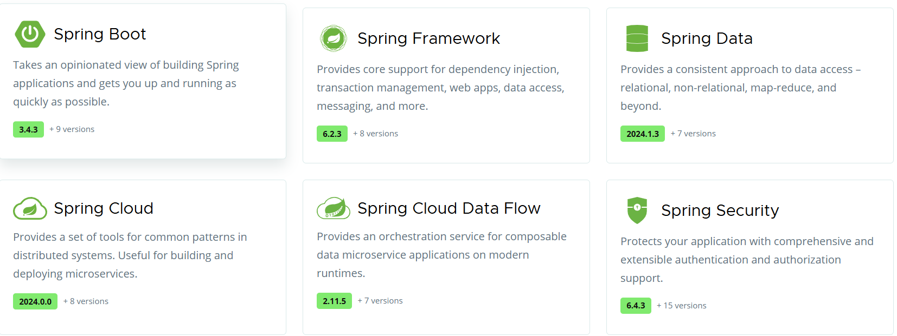

스프링과 객체지향
==
> 출처 : 김영한의 [스프링 핵심 원리 - 기본편](https://www.inflearn.com/course/%EC%8A%A4%ED%94%84%EB%A7%81-%ED%95%B5%EC%8B%AC-%EC%9B%90%EB%A6%AC-%EA%B8%B0%EB%B3%B8%ED%8E%B8/dashboard)

스프링 생태계
--

스프링은 이 이외에도 많은 것들을 지원함

- 핵심 기술: 스프링 DI 컨테이너, AOP, 이벤트, 기타
- 웹 기술 : 스프링 MVC, 스프링 WebFlux

스프링은 문맥에 따라 스프링 DI 컨테이너 기술, 스프링 프레임워크, 스프링 부트와 스프링 프레임워크 등을 모두 포함한 스프링 생테계를 말한다.

스프링의 핵심
--
좋은 **객체 지향 애플리케이션**을 개발할 수 있게 도와주는 프레임워크

객체 지향 프로그래밍
--
- 객체 지향 프로그래밍은 "**객체**"들의 모임으로 파악하고자 하는 것, 각각의 객체는 메시지를 주고받고, 데이터를 처리할 수 있다. (협력)
- 프로그램을 유연하고 변경에 용이하게 만든다.

다형성
--
- **역할**과 **구현**으로 세상을 구분하는 것
> - 클라이언트는 대상의 역할(인터페이스), 내부 구조 등을 몰라도 된다.
> - 인터페이스의 설계가 중요

SOLID
--
>  좋은 객체 지향 설계의 5가지 원칙
- SRP: 단일 책임 원칙(single responsibility principle)
> 한 클래스는 하나의 책임만 -> 모호한 기준이다.

> :rocket: 기준을 변경으로! -> 변경이 있을 때 파급효과가 적도록
 
- OCP: 개방-폐쇄 원칙 (Open/closed principle)
> 소프트웨어 요소는 확장에는 열려 있으나 변경에는 닫혀 있어야 한다

> :fire: 인터페이스 상속하는 클래스는 필요에 따라 확장 가능하나 클라이언트는 변경에 닫혀 있어야 한다 

- LSP: 리스코프 치환 원칙 (Liskov substitution principle)
> 프로그램의 객체는 프로그램의 정확성을 깨뜨리지 않으면서 하위 타입의 인스턴스로 바꿀 수 있어야 한다

> 하위 클래스는 인터페이스 규약을 지켜야 함

- ISP: 인터페이스 분리 원칙 (Interface segregation principle)
> 특정 클라이언트를 위한 인터페이스 여러 개가 범용 인터페이스 하나보다 낫다

- DIP: 의존관계 역전 원칙 (Dependency inversion principle)
> 추상화에 의존해야지, 구체화에 의존하면 안된다
> 역할에 의존해야지, 구현에 의존하면 안됨

:punch: 문제는 다형성만으로 OCP, DIP가 지켜지지 않는다는 것!!!
-  DI(Dependency Injection): 의존관계, 의존성 주입으로 이를 해결

정리
--
모든 설계는 객체 지향적으로 **역할**(인터페이스)과 **구현**(하위 클래스)을 분리해야한다!